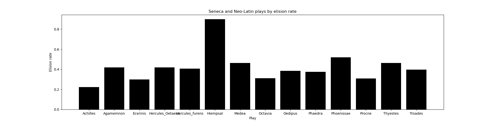
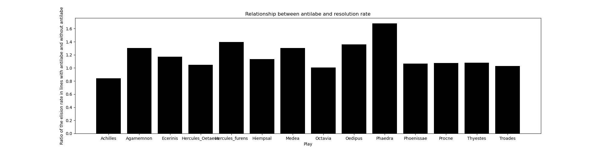

# Senecan Trimeter and Humanist Tragedy

This repository includes the data and code relevant to the article Fedchin, Burns, Chaudhuri, and Dexter "Senecan Trimeter and Humanist Tragedy," forthcoming in *American Journal of Philology* (2022) The repository contains the scansions of all trimeter passages from Albertino Mussato's *Ecerinis*, Antonio Loschi's *Achilles*, Gregorio Correr's *Procne*, Leonardo Dati's *Hiempsal*, and the ten plays comprising the Senecan corpus. The results presented here are fully [reproducible](#how-to-reproduce-this).

## Abstract

The lack of extant contemporary comparanda obscures the workings of iambic trimeter in Senecan tragedy. This article offers a quantitative analysis of the reception of Senecan trimeter in four early works of Italian Humanist Tragedy, which illuminates the creative possibilities afforded by the basic structure of the meter and identifies specific features important to questions of style and semantics. Our analysis demonstrates, among other things, that both Seneca and the Humanist tragedians use clusters of resolutions in conjunction with antilabe as a literary device to convey high emotion.

## Analysis

The scansions were generated for O. Zwierlein's 1986 edition of the Senecan plays and G. Grund's 2011 edition of the four Neo-Latin plays with the help of [anceps](https://github.com/Dargones/anceps), a Latin scansion tool specifically created for the purpose. We also accepted Padrin's emendations for *Ecerinis*  283, 353, and 508 as these changes allow these lines to be scanned.

Overall, we analyzed 10845 lines of iambic trimeter, of which 9875 were scanned fully automatically (automatic scansions of most difficult lines were verified in 671 cases and corrected in 208 cases), 630 were scanned with human help (i.e. the human had to select from several scansion options), 323 had to be scanned manually, and 17 lines from the Neo-Latin texts were left unscanned due to metrical anomalies. These latter 17 lines are not included in the analysis below.
For the in-depth analysis of the data and figures below, please refer to the paper. The following figures showcase the kind of information that can be extracted automatically from the scansion files thereby allowing further study of the material.

The first table shows how resolutions are distributed across the six feet of iambic trimeter in the fourteen texts in question. For each foot and play,  the table specifies what fraction of all resolutions in the play occur at that foot.

| Play       | 1st foot | 2nd foot | 3rd foot | 4th foot | 5th foot | 6th foot |
| :--------- | :----    | :----    | :----    | :----    | :----    | :----    |
|Achilles|0.36|0.24|0.15|0.05|0.19|0.0|
|Agamemnon|0.32|0.19|0.16|0.07|0.27|0.0|
|Ecerinis|0.25|0.19|0.16|0.17|0.23|0.0|
|Hercules_Oetaeus|0.28|0.19|0.18|0.03|0.33|0.0|
|Hercules_furens|0.31|0.16|0.19|0.06|0.28|0.0|
|Hiempsal|0.32|0.14|0.3|0.1|0.15|0.0|
|Medea|0.32|0.15|0.23|0.06|0.24|0.0|
|Octavia|0.34|0.15|0.19|0.04|0.28|0.0|
|Oedipus|0.31|0.19|0.16|0.05|0.29|0.0|
|Phaedra|0.33|0.15|0.19|0.05|0.28|0.0|
|Phoenissae|0.32|0.14|0.2|0.09|0.25|0.0|
|Procne|0.25|0.22|0.18|0.07|0.2|0.08|
|Thyestes|0.31|0.14|0.2|0.07|0.28|0.0|
|Troades|0.33|0.18|0.17|0.05|0.27|0.0|


The following table presents the same kind of information about elision rates. Note that elisions are distributed almost uniformly in *Hiempsal*, a fact that might explain the high elision rate in this play. (see next figure)

| Play       | 1st foot | 2nd foot | 3rd foot | 4th foot | 5th foot | 6th foot |
| :--------- | :----    | :----    | :----    | :----    | :----    | :----    |
|Achilles|0.25|0.04|0.04|0.37|0.29|0.0|
|Agamemnon|0.26|0.1|0.06|0.3|0.26|0.02|
|Ecerinis|0.26|0.2|0.11|0.34|0.07|0.01|
|Hercules_Oetaeus|0.22|0.12|0.07|0.27|0.31|0.02|
|Hercules_furens|0.22|0.11|0.07|0.23|0.35|0.01|
|Hiempsal|0.23|0.18|0.23|0.2|0.15|0.01|
|Medea|0.25|0.12|0.06|0.23|0.33|0.02|
|Octavia|0.26|0.11|0.03|0.26|0.31|0.03|
|Oedipus|0.24|0.09|0.04|0.32|0.29|0.01|
|Phaedra|0.23|0.09|0.06|0.29|0.32|0.02|
|Phoenissae|0.27|0.1|0.08|0.23|0.3|0.02|
|Procne|0.2|0.1|0.07|0.36|0.25|0.01|
|Thyestes|0.23|0.1|0.09|0.24|0.32|0.02|
|Troades|0.23|0.1|0.06|0.24|0.35|0.01|


The figure below compares the tragedies in question by elision frequency. The outliers are *Hiempsal* and *Achilles*.



The final figure shows that resolution is on average more common in *antilabe* than in monologues. For each play, the figure identifies the ratio of resolution rates in lines with and without antilabe, a ratio that is higher than *1* for all plays except *Achilles*.



Please see the [linked code snippet](https://gist.github.com/Dargones/62e58dd3929de66be886b35ca20bba0f) for the method we use to compute the probability of encountering streaks of lines without resolution.

## How to reproduce this

This report can be generated automatically by running ```python3 reports/make_report.py```.
The script processes the information found in the [scansion files](#). The scansions can in turn be obtained by running [anceps](https://github.com/Dargones/anceps) on raw text while also supplying the manually created scansions stored [here](#)

Note that the Neo-Latin texts require special treatment when scanned with **anceps**: when scanning Correr or Dati, replace the `trimeter` argument with `trimeterCORRER` or `trimeterDATI` respectively; when scanning Loschi, use the `--no_diphthongs` flag to account for his orthography and use the specially constructed MqDqMacronsNoDiphthongs.json dictionary instead of the regular MqDqMacrons.json.

## Acknowledgments
A.F. thanks Robert Cioffi for supporting this project from its very inception and providing invaluable feedback on numerous early drafts, and James Romm for helping to put the text into the broader perspective of Senecan scholarship. This work was conducted under the auspices of the Quantitative Criticism Lab (https://qcrit.org), an interdisciplinary group co-directed by P.C. and J.P.D. and supported by an American Council of Learned Societies Digital Extension Grant and a National Endowment for the Humanities Digital Humanities Advancement Grant (grant number HAA271822-20). P.C. was supported by a New Directions Fellowship from the Andrew W. Mellon Foundation, and J.P.D. by a Neukom Fellowship and a Harvard Data Science Fellowship.

## Citation
Fedchin, A., Burns, P.J., Chaudhuri, P. and Dexter, J.P. "Senecan Trimeter and Humanist Tragedy," forthcoming in American Journal of Philology (2022) 
